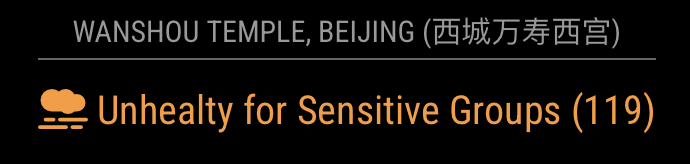
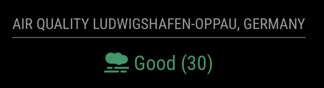

[](https://sonarcloud.io/summary/new_code?id=CFenner_MMM-AirQuality)
[](https://sonarcloud.io/summary/new_code?id=CFenner_MMM-AirQuality)
[](https://sonarcloud.io/summary/new_code?id=CFenner_MMM-AirQuality)
[](https://sonarcloud.io/summary/new_code?id=CFenner_MMM-AirQuality)
[](#contributors-)
[](https://choosealicense.com/licenses/mit/)

# MMM-AirQuality

A module for the [MagicMirror](https://github.com/MagicMirrorOrg/MagicMirror) to display a location's [*air quality index*](https://en.wikipedia.org/wiki/Air_quality_index) using data from [aqicn.org](http://aqicn.org/here/).

## Preview



with header and location



without any header


## Usage

You need to install and configure the module for your MagicMirror.

### Setup

Clone the module into your modules folder:

```shell
cd ~/MagicMirror/modules && git clone https://github.com/CFenner/MMM-AirQuality
```

### Configuration

Add the module configuration to your `config.js` file.

```js
{
  module: 'MMM-AirQuality',
  position: 'top_center',
  config: {
    token: 'ADD_YOUR_TOKEN_HERE',
    location: 'germany/hamburg/sternschanze/' // the location to check the index for
  }
},
```

### Token

To use the WAQI API you need to [request a token](https://aqicn.org/data-platform/token/).

### Location

Determine the station you want to display. Select a station on the [map](https://aqicn.org/here/) and copy the location part from the URL. For example `http://aqicn.org/city/netherland/utrecht/griftpark/` would be `netherland/utrecht/griftpark/`.

You may also get the data for specific longitude and latitude. Set the `location` to `geo::lat;:lng/` and replace `lat` and `lng` with your values.

If your station is affiliated with a third-party air sensor network, such as the uRad Monitor air quality sensor network, you are required to specify the station identifier (e.g., A129586) to set `location`. Please verify data retrieval by visiting `https://api.waqi.info/feed/<provide station Id>/?token=<provide your token>`.

You may want to set the following options in the config section as well:

| Option |  Description | Default | Required |
|---|---|---|---|
| `location` | The location for that you you want to show the air quality.|| x |
| `lang` | change the language | `en`||
| `updateInterval` | change the update period in minutes  | `30` ||
| `showLocation` | toggle location printing | `true` ||
| `appendLocationNameToHeader` | If set to `true`, the returned location name will be appended to the header of the module. | `true` ||
| `showIndex` | toggle index printing | `true` ||

### Known Issues

- Due to the AQI rendering script it is not possible to have multiple instances of this module running.
- There is a bug in the skript that prevent some locations from being displayed (e.g. 'Mannheim').
- Not all languages may be supported (see: <http://aqicn.org/faq/2015-07-28/air-quality-widget-new-improved-feed/>).

## Contributors ✨

Thanks goes to these wonderful people ([emoji key](https://allcontributors.org/docs/en/emoji-key)):

<!-- ALL-CONTRIBUTORS-LIST:START - Do not remove or modify this section -->
<!-- prettier-ignore-start -->
<!-- markdownlint-disable -->
<table>
  <tbody>
    <tr>
      <td align="center" valign="top" width="14.28%"><a href="http://www.justin-c.com"><br /><sub><b>Justin Cherniak</b></sub></a><br /><a href="https://github.com/CFenner/MMM-AirQuality/commits?author=jcherniak" title="Code">💻</a></td>
    </tr>
  </tbody>
</table>

<!-- markdownlint-restore -->
<!-- prettier-ignore-end -->

<!-- ALL-CONTRIBUTORS-LIST:END -->

This project follows the [all-contributors](https://github.com/all-contributors/all-contributors) specification. Contributions of any kind welcome!
